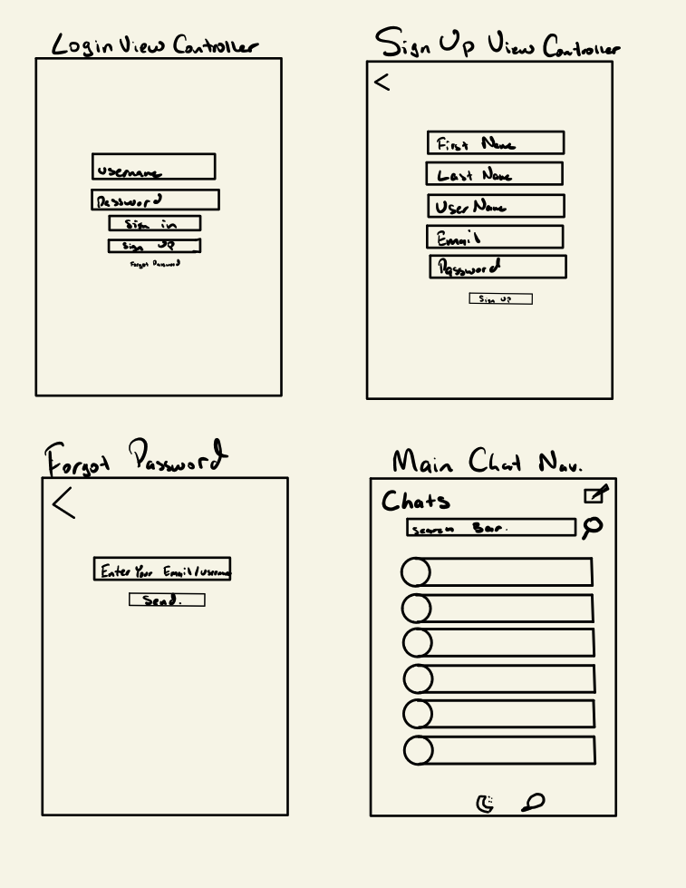
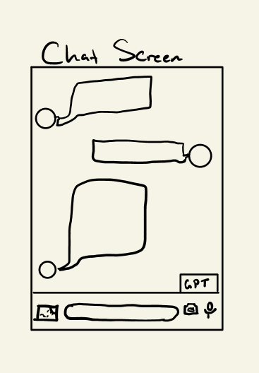

# GPTalk

## Table of Contents
1. [Overview](#Overview)
1. [Product Spec](#Product-Spec)
1. [Wireframes](#Wireframes)
2. [Schema](#Schema)

## Overview
### App Description
GPTalk is an iOS text messaging app that allows the user to converse with GPT-4 in the middle of their conversations utilizing the OpenAI API. 

## Demo

## Instructions
To run the app, follow these steps: 
1. Git clone this repo
2. Add the appropriate API keys to Constants.swift
3. Open in Xcode and run

## App Evaluation

- **Category:** Messaging
- **Mobile:** A messaging app, it can send notifications, allows the user to take pictures, can take calls/video calls, can send location
- **Story:** With the rise of ChatGPT and its added functionalities that allows people to become more productive than other, we are providing our users with the ability to ask GPT questions within conversations without having to go through the online website and allow multiple users to ask GPT within the same session. 
- **Market:** Includes both casual users, as well as corporal level associates where they can use GPT to allow their meetings and conversations to be more productive and efficient
- **Habit:** People will return to the app to continue their conversations both with GPT itself as well as with their friends/ business co-workers.
- **Scope:** The integration of GPT is interesting, as well as the calling/messaging functionality of the application will be fairly technical and will continue to make the project interesting for both ourselves as well as future admirers

## Product Spec

### 1. User Stories (Required and Optional)

**Required Must-have Stories**

* Log-in
* Sign-up
* Forget password
* Main page, with all chats
* Search bar at the top
* Each table view cell will go to a separate view controller for specific chats
* Utilize GPT API within the conversation
* Add camera functionality
* Add image picker functionality
* Adding friend functionality
* Group chats

**Optional Nice-to-have Stories**
* Calling / Video Calling
* A separate tab that shows recent calls / missed calls 
* Sending location
* Having customizability, profile change/background color change
* Profile picture
* Blocking functionality
* Showing a status / showing a story 
* Add gifs 
* Pinned messages 
* Send voice messages
* Email subscription/verifying email

### 2. Screen Archetypes

* Login Screen
   * Username / Password text fields
   * Login-Button
   * Sign-up Button
   * Forgot Password Button
   
* Sign Up Screen
   * Username
   * Email
   * First and Last Name
   * Password

* Forgot Password Screen
   * Enter your email / username 
   * Send email button
   
* Main Chat Navigation Screen
   * All individual chats 
   * Create/delete chats
   * Logout
  
* Chat screen
   * Send message bar
   * Choose camera 
   * Choose image / file
   * Send message button
   * GPT commands “@GPT” 
   * Reactions
   * Replies
 

### 3. Navigation

**Flow Navigation** (Screen to Screen)
* Log In
	* Sign Up
	* Main Chat Navigation
	* Forgot Password Screen

* Forgot Password Screen
	* Log In

* Sign Up
	* Log In
	* Main Chat Navigation

*  Main Chat Navigation 
	* Chat Screen
	* Log in
	* 

* Chat Screen
	* Main Chat Navigation

## Wireframes

